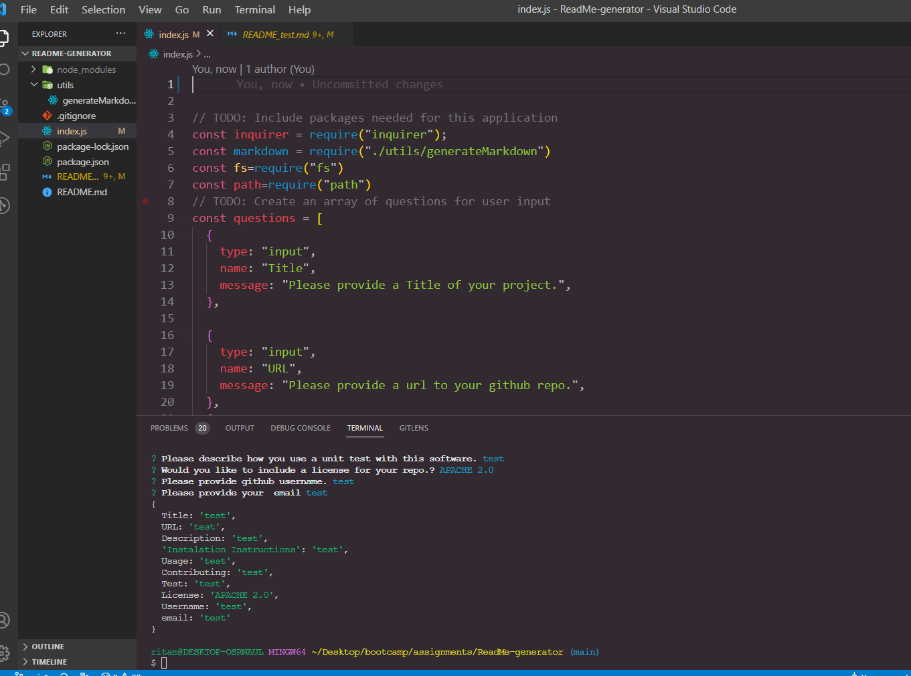
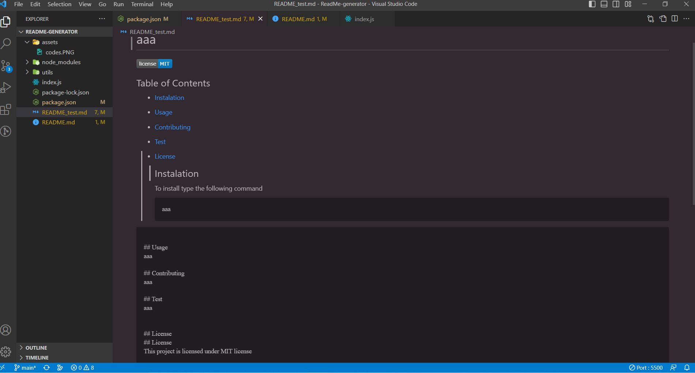

## Title: ReadMe-Generator

## Acceptance Creteria

Create command-line application that accepts user input.
A promp apears for information about application repo.
README.md is generated that includes title of your project,Description, Table of Contents, Installation, Usage, License, Contributing, Tests, and Questions.
Upon entering your project title then displays as the title of the README.
Upon entering a description, installation instructions, usage information, contribution guidelines, and test instructions
THEN the information is added to the sections of the README. -->
Upon choosing a license for your application from a list of options
A badge for that license is added to the README.
Upon entering your GitHub username, its added to the README witha link to your github profile.
Upon entering your email address, a question with the instructions to reach me with more question is added to teh README.

## Table of content

- [Instalation] (#instalation)
- [Usage] (#usage)
- [Contributing] (#contributing)
- [Test] (#test)
- [License] (#license)

## Note

Tutor assisted me with this assignment

## Screenshot

